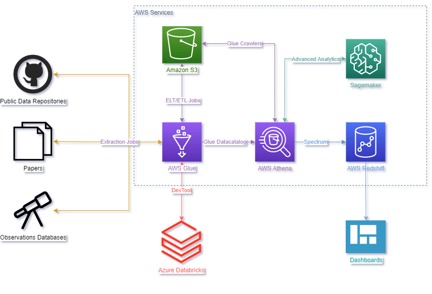
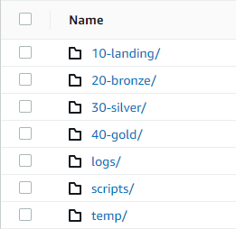

# Pletora Supernovae Project

## Table of Contents

* [General Information](#general-information)
* [Technologies Used](#technologies-used)
* [Data Sources](#data-sources)
* [Storage](#storage)
* [Jobs](#jobs)
* [Contributing](#contributing)
* [Contact](#contact)

## General Information

The Pletora Supernovae Project aims to centralize and organize supernova data in a data lake, using Amazon Web Services (AWS). This project is committed to providing researchers from all over the globe easy access to valuable data, thereby facilitating collaboration and knowledge sharing, and ultimately advancing our understanding of cosmology and astrophysics.

As the amount of observational data available to scientists grows exponentially, modern cosmology heavily relies on cloud architectures and big data tools. These tools can handle the sheer volume of data generated by instruments like the James Webb Telescope and the Large Synoptic Space Telescope and process them into meaningful insights.

This repository will contain all the AWS Glue Jobs used in the project, and we encourage to consult our utility package, available for consultation in a [GitHub repository](https://github.com/Pletora-Data-Solutions/Glue-DataLake-Utility-Package).

## Technologies Used

* [Amazon Web Services (AWS)](https://aws.amazon.com/)
  * [AWS Glue 3.0](https://aws.amazon.com/glue/) 
    * [Job](https://docs.aws.amazon.com/glue/latest/dg/add-job.html)
    * [Crawler](https://docs.aws.amazon.com/glue/latest/dg/add-crawler.html)
  * [Amazon S3](https://aws.amazon.com/pt/s3/) 
  * [Amazon Athena](https://aws.amazon.com/athena/) 
  * [Amazon Redshift](https://aws.amazon.com/redshift/) 
  * [Amazon SageMaker](https://aws.amazon.com/sagemaker/) 
* [Databricks](https://www.databricks.com/) 
* [Python 3](https://www.python.org/) 
    * [PySpark - Spark 3.1](https://spark.apache.org/docs/latest/api/python/)
* [SQL](https://pt.wikipedia.org/wiki/SQL) 

Initially, Databricks is used as a development environment for AWS Glue Jobs, the tool used to load and manipulate data in Amazon S3 or query tables with Amazon Athena. Both Databricks and Jobs use Python/PySpark and SQL; Amazon S3 is the storage for data lake; and AWS Glue Crawler creates the tables that are queried by Amazon Athena.

The data in the data lake can be used to train machine learning models, which can be deployed using Amazon SageMaker. Additionally, a data warehouse can be created using Amazon Redshift to store the data in a structured format and create dashboards for data visualization.

## Data Sources

Our goal is to centralize and normalize data that can be found in public repositories, articles and observational databases.

Our main data source at the moment is the [Open Supernova Catalog (OSC)](https://github.com/astrocatalogs/supernovae), which provides a comprehensive list of supernova observations. The supernovae data are stored in separate repositories that are collated by year. The data files are in [JSON format](https://www.json.org/json-en.html), a detailed description of the particular structure we have chosen is available in a [GitHub repository](https://github.com/astrocatalogs/schema).

## Storage 

The data is stored in an Amazon S3 bucket named `pletora-supernovae`, from there the data lake is built. To ensure data quality and reliability, data is organized into four layers: `10-landing`, `20-raw`, `30-refined` and `40-trusted`. The numbers on the front are to keep the folders in the correct order. In addition, we have the `logs`, `scripts` and `temp` folders.

By using a multi-layered approach to data storage, we can ensure that the data in the data lake can be easily accessed and analyzed by users with varying levels of technical expertise.

### `10-landing`

It is the destination for new data as it arrives in the data lake. Within it, we have a file structure that shows the origin of the data, in addition to a folder to indicate the date that its upload was carried out within the part. In this layer, we keep the file in its original format. For example: `s3://pletora-supernovae/10-landing/git/astrocatalogs/sne-2005-2009/2023-03-23/supernovae.json` is a S3 URI, where `pletora-supernovae` is the bucket, `10-landing` is the layer, `git` indicates that the data source is GitHub, `astrocatalogs` is the GitHub organization, `sne-2005-2009` is the repository name, `2023-03-23` is the upload date and `supernovae.json` is the file name in JSON format.

### `20-raw`

In this layer, data is transformed into Parquet format and in some cases it is necessary to make some changes to mitigate issues. We chose the Parquet format because it is a columnar storage format that provides efficient compression and encoding schemes. This makes it easier and faster to query the data later using Amazon Athena. The folder structure is the same as the previous layer, with the difference that the filename is automatically generated by PySpark. For example: `s3://pletora-supernovae/20-raw/git/astrocatalogs/sne-2005-2009/2023-03-23/part-00002-b966a97c-a78c-488e-91da-158b7a580c5a.c000.snappy.parquet`.

### `30-refined`

For this layer, we reorganize the previous layer's data into tables. We only use the most up-to-date files. From this, we built general tables about the supernovae. For example, for the table with the information of each observation made, the folder structure is `s3://pletora-supernovae/30-refined/observation_dimension/part-00000-3b9263b8-2048-4dc5-b7cb-cb6b4fd1de0c-c000.snappy.parquet`.

### `40-trusted`

At this stage, it's the same tables and folder structure as the previous layer. However, the data in this layer has been processed and validated, and users can be confident in its quality and accuracy.

### `logs`

Log files are software-generated files containing information about the operations, activities, and usage patterns of our data lake.

### `scripts`

In this folder, the wheel file is located, created from the utility package, available for consultation in a [GitHub repository](https://github.com/Pletora-Data-Solutions/Glue-DataLake-Utility-Package). The folder structure is `s3://pletora-supernovae/scripts/libs/pipeline-1.0-py3-none-any.whl`.

### `temp`

Temporary files and folders that expire after a specified interval.

## Jobs

Our project uses AWS Glue Jobs to extract and process supernovae data. AWS Glue Jobs are a powerful service that supports the entire data pipeline, including extract, transform, and load (ETL). 

Each Job is named according to the layer name and source/table name for clarity. For the `10-landing` and `20-raw layers`, we use a Job for each data source. For example, for the landing layer data, which came from GitHub, we have a Job named `landing_github_supernovae`.

For the last layers, `30-refined` and `40-trusted`, we use a Job for each created table. For example, for the table with the information of each observation made, we have a Job named `refined_observation_dimension`.

## Contributing 

Contributions are greatly appreciated!

1. Fork the project.
2. Create your feature branch: `git checkout -b feature/AmazingFeature`.
3. Commit your changes: `git commit -m 'Add some amazing stuff'`.
4. Push to the branch: `git push origin feature/AmazingFeature`.
5. Create a new Pull Request.

Issues and feature requests are welcome!

## Contact

Feel free to send contributions, reviews, questions and/or suggestions for each of the project participants:

 
<table>
  <tr>
    <td align="center"> <b> Lucas Corbanez </b> (Coordinator)</td>
    <td>
       
       
      
      </td>
  </tr>
  <tr>
    <td align="center"> <b> Adriano Junior Gouveia Gonçalves </b> </td>
    <td>
       
       
      
    </td>
  </tr>
  <tr>
    <td align="center"> <b> Douglas Sanini </b> </td>
    <td>
       
       
      
    </td>
  </tr>
</table>

